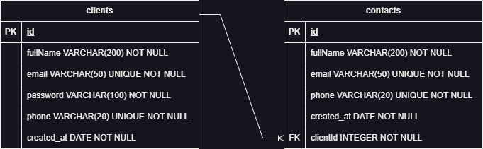

# fullstack-project-backend

## Tabela de Conteúdos

- [Visão Geral](#1-visão-geral)
- [Diagrama DER](#2-diagrama-DER)
- [Iniciando a aplicação localmente](#3-iniciando-a-aplicação-localmente)
  - [Instalando Dependências](#31-instalando-dependências)
  - [Variáveis de Ambiente](#32-variáveis-de-ambiente)
  - [Migrations](#33-migrations)
- [Endpoints](#4-endpoints)
  - [Clients](#41-clients)
  - [Contacts](#42-contacts)

## 1. Visão Geral

Esta API faz parte de um projeto Full Stack, em que o objetivo é construir uma aplicação Full Stack onde seja possível realizar o cadastro de clientes e de contatos que estarão associados a esse cliente.
A validação dos dados enviados no corpo da requisição foi feita utilizando o zod, dados extras são removidos enquanto que caso uma chave obrigatória não seja enviada uma resposta de error será retornada.

Tecnologias utilizadas:

- [NodeJS](https://nodejs.org/en/)
- [Express](https://expressjs.com/pt-br/)
- [TypeScript](https://www.typescriptlang.org/)
- [PostgreSQL](https://www.postgresql.org/)
- [TypeORM](https://typeorm.io/)
- [Zod](https://zod.dev)

URL base da aplicação: https://fullstack-project-gmcc.onrender.com

---

## 2. Diagrama DER

[ Voltar para o topo ](#tabela-de-conteúdos)

Diagrama ER da API definindo a relação entre a tabela de clientes e contatos.



---

## 3. Iniciando a aplicação localmente

[ Voltar para o topo ](#tabela-de-conteúdos)

### 3.1. Instalando Dependências

Clone o projeto em sua máquina e instale as dependências com o comando:

```shell
npm i
```

### 3.2. Variáveis de Ambiente

Em seguida, crie um arquivo **.env**, copiando o formato do arquivo **.env.example**:

```
cp .env.example .env
```

Configure suas variáveis de ambiente com suas credenciais do Postgres e uma nova database da sua escolha.

### 3.3. Migrations

Execute as migrations com o comando:

```
yarn typeorm migration:run -d src/data-source.ts
```

---

## 4. Endpoints

[ Voltar para o topo ](#tabela-de-conteúdos)

| Método | Endpoint      | Responsabilidade                          | Autenticação                  |
| ------ | ------------- | ----------------------------------------- | ----------------------------- |
| POST   | /clients      | Criação de um cliente                     | Não necessita de autenticação |
| GET    | /clients      | Retorna as informações do usuário         | Necessita de autenticação     |
| PATCH  | /clients      | Atualiza um cliente                       | Necessita de autenticação     |
| DELETE | /clients      | Deleta o cliente                          | Necessita de autenticação     |
| POST   | /login        | Gera o token de autenticação              | Não necessita de autenticação |
| POST   | /contacts     | Criação do contato                        | Necessita de autenticação     |
| GET    | /contacts     | Lista todas os contatos do usuário logado | Necessita de autenticação     |
| PATCH  | /contacts/:id | Atualiza informações de um contato        | Necessita de autenticação     |
| DELETE | /contacts/:id | Deleta um contato                         | Necessita de autenticação     |

Rotas que necessitam de autorização retornarão um erro caso o token não seja enviado ou esteja incorreto:

##### Token não enviado

```json
{
  "message": "Missing bearer token"
}
```

##### Token inválido

```json
{
  "message": "jwt malformed"
}
```

### 4.1. Clients

#### 4.1.1. Criação de clientes

[ Voltar para os Endpoints ](#4-endpoints)

#### Exemplo de Request:

```
POST /clients
Host: https://fullstack-project-gmcc.onrender.com
Authorization: None
Content-type: application/json
```

#### Corpo da Requisição:

```json
{
  "fullName": "Client Fulano",
  "email": "client@mail.com",
  "password": "1234",
  "phone": "+55 11 9999-9998"
}
```

#### Exemplo de Response:

```
201 Created
```

```json
{
  "id": "92a1f567-70de-43c1-b394-3aaf487506ed",
  "fullName": "Client",
  "email": "client@mail.com",
  "phone": "+55 11 99999-9999",
  "createdAt": "2023-05-25"
}
```

#### Possíveis Erros:

##### Email já cadastrado

```
409 Conflict
```

```json
{
  "message": "Email already exists"
}
```

##### Phone já cadastrado

```
409 Conflict
```

```json
{
  "message": "Phone already exists"
}
```

##### Requisição com dados incompletos

```
404 Bad Request
```

```json
{
  "message": {
    "fullName": ["Required"],
    "email": ["Required"],
    "password": ["Required"],
    "phone": ["Required"]
  }
}
```

#### 4.1.2. Retornando cliente logado

[ Voltar para os Endpoints ](#4-endpoints)

#### Exemplo de Request:

```
GET /clients
Host: https://fullstack-project-gmcc.onrender.com
Authorization: Bearer token
Content-type: application/json
```

#### Corpo da Requisição:

```json
Vazio
```

#### Exemplo de Response:

```
200 OK
```

```json
{
  "id": "92a1f567-70de-43c1-b394-3aaf487506ed",
  "fullName": "Client",
  "email": "client@mail.com",
  "phone": "+55 11 99999-9999",
  "createdAt": "2023-05-25",
  "contacts": []
}
```

#### Possíveis Erros:

Token não enviado

#### 4.1.3. Atualizando cliente

[ Voltar para os Endpoints ](#4-endpoints)

#### Exemplo de Request:

```
PATCH /clients
Host: https://fullstack-project-gmcc.onrender.com
Authorization: Bearer token
Content-type: application/json
```

#### Corpo da Requisição:

Pode ser enviado uma ou mais chaves

```json
{
  "fullName": "Client Updated"
}
```

#### Exemplo de Response:

```
200 OK
```

```json
{
  "id": "92a1f567-70de-43c1-b394-3aaf487506ed",
  "fullName": "Client Updated",
  "email": "client@mail.com",
  "phone": "+55 11 99999-9999",
  "createdAt": "2023-05-25",
  "contacts": []
}
```

#### Possíveis Erros:

##### Email já cadastrado

```
409 Conflict
```

```json
{
  "message": "Email already exists"
}
```

##### Phone já cadastrado

```
409 Conflict
```

```json
{
  "message": "Phone already exists"
}
```

#### 4.1.4. Deletando cliente

[ Voltar para os Endpoints ](#4-endpoints)

#### Exemplo de Request:

```
DELETE /clients
Host: https://fullstack-project-gmcc.onrender.com
Authorization: Bearer token
Content-type: application/json
```

#### Corpo da Requisição:

```json
Vazio
```

#### Exemplo de Response:

```
204 No Content
```

```json
Vazio
```

#### Possíveis Erros:

Token não enviado

### 4.2. Contacts

#### 4.2.1. Criação de um contato

[ Voltar para os Endpoints ](#4-endpoints)

#### Exemplo de Request:

```
POST /contacts
Host: https://fullstack-project-gmcc.onrender.com
Authorization: Bearer token
Content-type: application/json
```

#### Corpo da Requisição:

```json
{
  "fullName": "Contact",
  "email": "contact@mail.com",
  "phone": "+55 11 99999-9998"
}
```

#### Exemplo de Response:

```
201 Created
```

```json
{
  "id": "d37e5cdd-20f2-4911-8b3c-ac68b95ce9e7",
  "fullName": "Contact",
  "email": "contact@mail.com",
  "phone": "+55 11 99999-9998",
  "createdAt": "2023-05-25"
}
```

#### Possíveis Erros:

Token não enviado

##### Email já cadastrado

```
409 Conflict
```

```json
{
  "message": "Email already exists"
}
```

##### Phone já cadastrado

```
409 Conflict
```

```json
{
  "message": "Phone already exists"
}
```

##### Requisição com dados incompletos

```
404 Bad Request
```

```json
{
  "message": {
    "fullName": ["Required"],
    "email": ["Required"],
    "phone": ["Required"]
  }
}
```

#### 4.2.2. Listagem de contatos

[ Voltar para os Endpoints ](#4-endpoints)

#### Exemplo de Request:

```
POST /contacts
Host: https://fullstack-project-gmcc.onrender.com
Authorization: Bearer token
Content-type: application/json
```

#### Corpo da Requisição:

```json
Vazio
```

#### Exemplo de Response:

```
200 OK
```

```json
[
  {
    "id": "d37e5cdd-20f2-4911-8b3c-ac68b95ce9e7",
    "fullName": "Contact",
    "email": "contact@mail.com",
    "phone": "+55 11 99999-9998",
    "createdAt": "2023-05-25"
  },
  {
    "id": "e38a4ef8-cd4b-4858-8c2e-a53ff4312d60",
    "fullName": "Contact2",
    "email": "contact2@mail.com",
    "phone": "+55 11 99999-9997",
    "createdAt": "2023-05-25"
  }
]
```

#### Possíveis Erros:

Token não enviado

#### 4.2.3. Atualização de um contato

[ Voltar para os Endpoints ](#4-endpoints)

#### Exemplo de Request:

```
PATCH /contacts/d37e5cdd-20f2-4911-8b3c-ac68b95ce9e7
Host: https://fullstack-project-gmcc.onrender.com
Authorization: Bearer token
Content-type: application/json
```

#### Corpo da Requisição:

```json
Vazio
```

#### Exemplo de Response:

```
200 OK
```

```json
{
  "id": "e38a4ef8-cd4b-4858-8c2e-a53ff4312d60",
  "fullName": "Contact Updated",
  "email": "contact2@mail.com",
  "phone": "+55 11 99999-9997",
  "createdAt": "2023-05-25"
}
```

#### Possíveis Erros:

Token não enviado

##### Contact not found

```
404 Not Found
```

```json
{
  "message": "Contact not found"
}
```

##### Email já cadastrado

```
409 Conflict
```

```json
{
  "message": "Email already exists"
}
```

##### Phone já cadastrado

```
409 Conflict
```

```json
{
  "message": "Phone already exists"
}
```

#### 4.2.4. Deletando um contanto

[ Voltar para os Endpoints ](#4-endpoints)

#### Exemplo de Request:

```
DELETE /contacts/e38a4ef8-cd4b-4858-8c2e-a53ff4312d60
Host: https://fullstack-project-gmcc.onrender.com
Authorization: Bearer token
Content-type: application/json
```

#### Corpo da Requisição:

```json
Vazio
```

#### Exemplo de Response:

```
200 OK
```

```json
Vazio
```

#### Possíveis Erros:

Token não enviado

##### Contact not found

```
404 Not Found
```

```json
{
  "message": "Contact not found"
}
```
